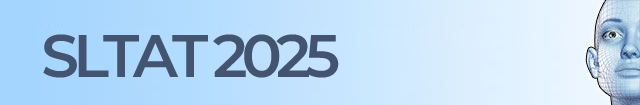

# SLTAT 2025: 9th Workshop on Sign Language Translation and Avatar Technologies

Recent research in the use of avatars to animate sign language promises to provide increased accessibility for deaf people. In addition, avatars support sign linguistics research, providing a potential target for translation from spoken and other sign languages, and scan light on human factors of sign language usage.

Submissions are invited for a full-day workshop that aims to bring together researchers who work with sign language translation with those who develop sign language avatar technologies.

The workshop will take place within the Intelligent Virtual Agents IVA2025 (<a href="https://iva.acm.org/2025/" target="_new">https://iva.acm.org/2025/</a>) conference at the HTW campus (directly at the river Spree) in Berlin, Germany.

The accepted workshop papers will be published via ACM as IVA 25 Adjunct Proceedings.

## Call for papers

See the [SLTAT 2025 Call for Papers](SLTAT2025-CFP.md) for details about content and submissions.

## Dates

* Submission deadline: ~~30 May 2025~~, 6 June 2025
* Notification of acceptance: 27 June 2025
* Camera ready: 28 July 2025 (Hard deadline, bound to the ACM publishing procedure)
* Submission of slides for interpreters' preparation (oral/signed presentations only): 1 September 2025
* Workshop day: 16 September 2025

## Previous editions

The first SLTAT dates back to 2011.
See the SLTAT history web page (<a href="http://sltat.cs.depaul.edu" target="_new">http://sltat.cs.depaul.edu</a>) for info on previous editions.

## Venue

HTW Campus, Berlin, Germany.

### Languages

The workshop languages are English and International Sign.

The oral/signed presentations will be interpreted into/from International Sign. The International Sign interpreters will also be around for the poster sessions to help out where necessary.

Deaf participants who prefer to bring interpreters for their national sign language are kindly encouraged to do so and to contact us well ahead of time so that we can plan the room accordingly.

### Travel and Accommodations

Please see the main IVA 2025 venue information (<a href="https://iva.acm.org/2025/venue/" target="_new">https://iva.acm.org/2025/venue/</a>).

## Instruction for Authors

**Papers** should be **prepared** in the “ACM Standard” format, more specifically the “SigConf” format (see instructions for the IVA full papers: <a href="https://iva.acm.org/2025/call-for-papers/" target="_new">https://iva.acm.org/2025/call-for-papers/</a>.
Accepted papers will be presented as either posters or for oral presentation with an equal value.

### Oral/Signed Presentations

TBA

### Poster Presentations

TBA

## Submitting

**Papers** can be **submitted** through the OpenReview platform at <a href="https://openreview.net/group?id=ACM.org/IVA/2025/Workshop/SLTAT" target="_new">https://openreview.net/group?id=ACM.org/IVA/2025/Workshop/SLTAT</a>

## Registration Fees

Our workshop is a full-day workshop.

## Program

Program at glance: TBA

Detailed Program: TBA

## Commitees

Organizing Committee:

* Fabrizio Nunnari, DFKI, Saarbrücken, Germany
* Rosalee Wolfe, ATHENA RC, Athens, Greece
* John C. McDonald, De Paul University, Chicago, US
* Michael Filhol, Université Paris-Saclay, France
* Eleni Efthimiou, ATHENA RC, Athens, Greece
* Evita Fotinea, ATHENA RC, Athens, Greece
* Thomas Hanke, University of Hamburg, Germany

Media manager:

* Cristina Luna Jiménez, University of Augsburg, Germany

## Sponsors

We are looking for sponsors to cover interpretation and travel/accommodation expenses!

Companies are very welcome to express their interest in providing help for the organization.

In exchange, sponsors will have logos and links printed in the workshop web sites, workshop proceedings, and on the official presentations.
In addition, we offer a space for advertisement during the poster sessions (approximately 2 hours in the morning and 2 in the afternoon), where you can promote your services to the German and the International academic community.

Please, contact us if interested.

## Contacts

The organizing committee can be reached by email at the following address: team_sltat2025help at dfki.de
